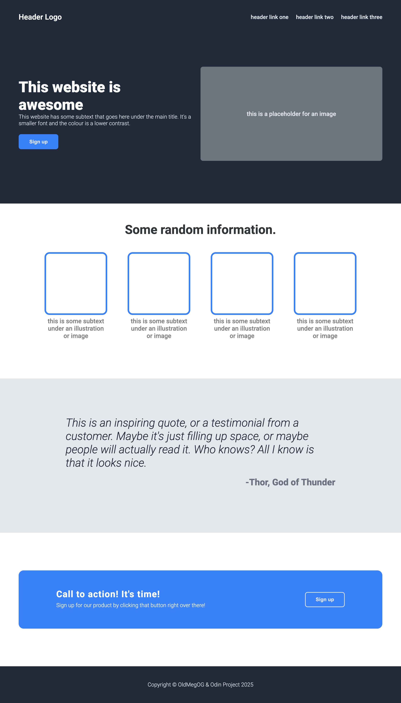

# Odin Project Landing Page

A responsive landing page built as part of The Odin Project's Foundations course. This project demonstrates HTML and CSS fundamentals including flexbox, responsive design, and modern web development practices.

## Live Demo

[View Live Site](https://oldmegOG.github.io/odin-landing-page)

## Features

- Responsive design that works on desktop and mobile
- Modern CSS with flexbox layout
- Semantic HTML structure
- Clean, professional styling
- Hover effects and smooth transitions

## Built With

- HTML5
- CSS3
- Google Fonts (Roboto)

## Screenshots



## What I Learned

This project helped me practice:

- CSS Flexbox for layout
- Responsive design principles
- Working with Google Fonts
- Creating hover effects and transitions
- Organizing CSS in a logical structure

## Installation

1. Clone the repository

```bash
git clone https://github.com/oldmegOG/odin-landing-page.git
```

2. Open `index.html` in your browser

## Acknowledgments

- Design provided by [The Odin Project](https://www.theodinproject.com/)
- Part of the Foundations course curriculum
